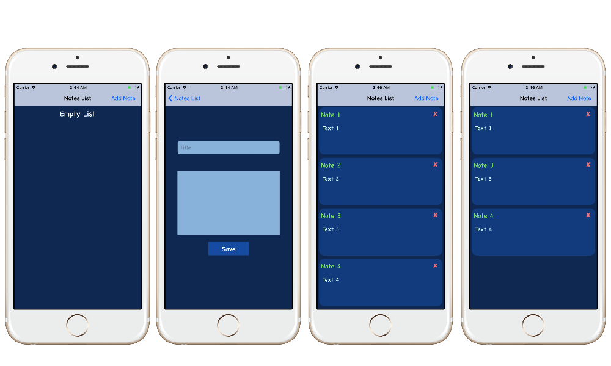

# xNOTA

## Description
xNota is Simple app that can store Notes as (Title , Text) using ``` CoreData ``` framework to store Notes at Device.

to main Operation :
   * Add Note
   * Remove Note


## Frames


## Main.storyBoard


## DEMO

