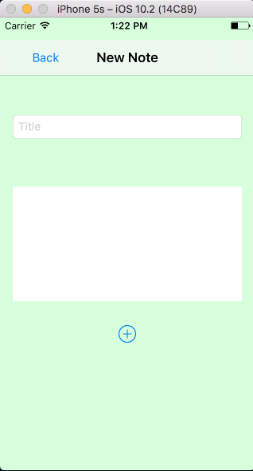
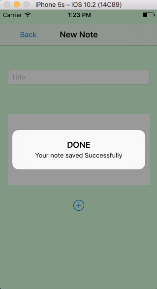
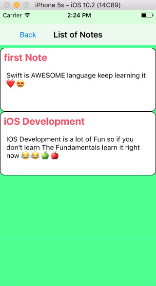
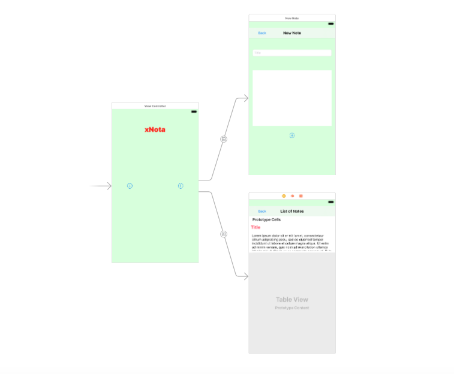

# xNOTA

xNOTA is a Simple iOS you can save your note and Browse it later.
language used : Swift 3 (Apple’s latest Programming Language)

## How to use it
   * Open Terminal
      * Clone Repository ->  git clone https://github.com/Mo7amedElnaggar/xNOTA.git
   * Open xNOTA in your xCode (Apple’s IDE)

## DEMO
<iframe width="700" height="400"
						src="https://www.youtube.com/embed/w0AwSggsfzU">
						</iframe>
						

## App photos

## Main.storyBoard
