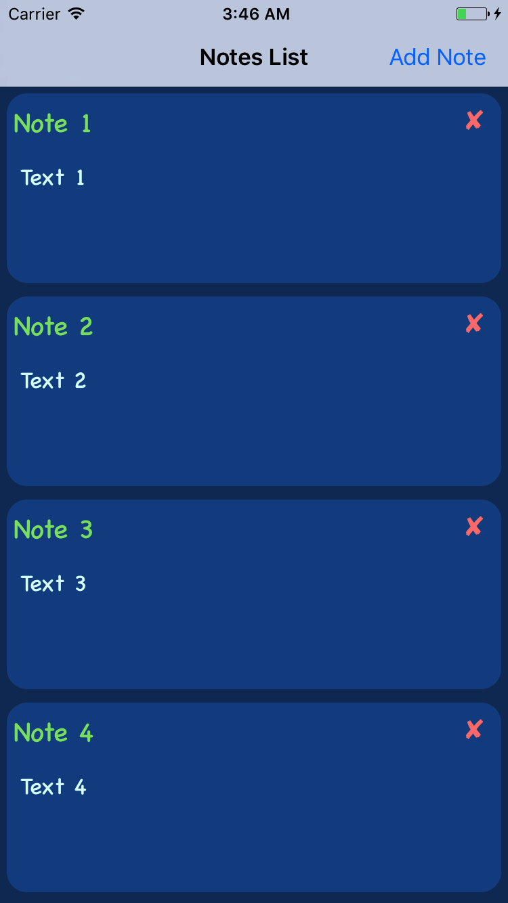
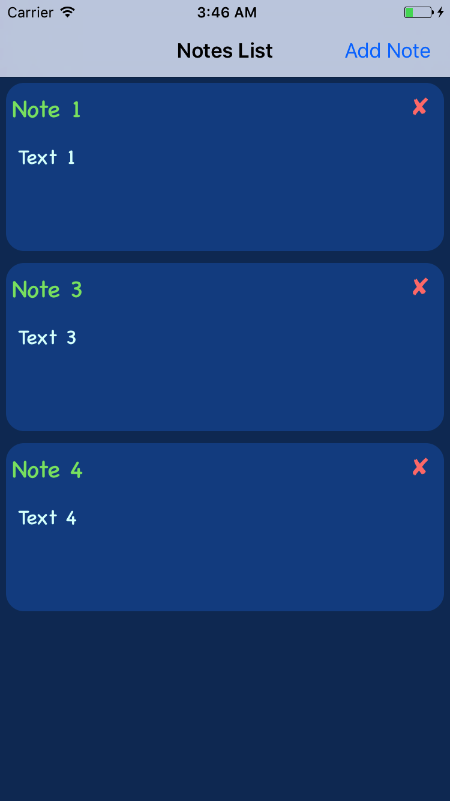

# xNOTA

xNOTA is a Simple iOS you can save your note and Browse it later.
language used : Swift 3 (Apple’s latest Programming Language)

## How to use it

Open Terminal
```
git clone https://github.com/Mo7amedElnaggar/xNOTA.git
```

```
cd xNOTA/
```

```
open xNOTA.xcodeproj
```

## DEMO


## App photos






## Main.storyBoard

